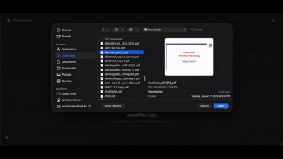
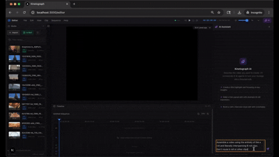
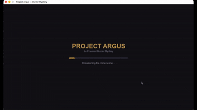
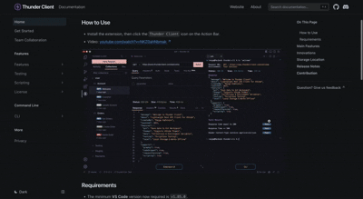
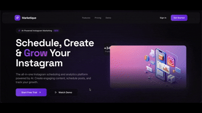
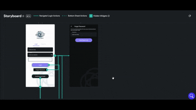
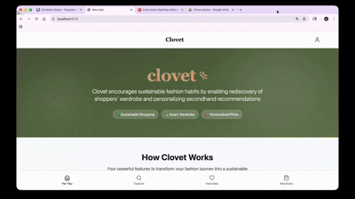
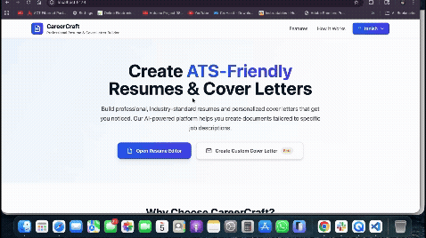
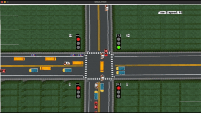

<div align="center">

# Hey, I'm Tanish. 

### Founding Engineer · 5x NYC Hackathon Champion · Patent Holder

I don't just write code — I ship production systems that scale.

[](https://tanish.dev)
[](https://linkedin.com/in/tanishvardhineni)
[](mailto:hello@tanish.dev)

</div>

---

```
$ whoami
> Tanish Vardhineni — MS Computer Engineering @ NYU Tandon
> Founding Engineer @ Thunder Client (10M+ installs)
> 4-0 NYC hackathon record. Patent holder. Builder of things that work.
```

## ⚡ The Numbers

| Metric | Value |
|---|---|
| **Production Users Served** | 10,000,000+ |
| **NYC Hackathon Record** | 5 wins, 0 losses |
| **Patents Filed** | 1 (AI + Hardware) |
| **Enterprise Experience** | HSBC, Thunder Client |

## 🏗️ What I Build

<table>
<tr>
<td width="50%">

### 🏆 Flagship Work
- **[Thunder Client](https://thunderclient.com)** — Founding Engineer of the world's #1 API testing tool. Built SSO, gRPC interface, RAG-powered doc engine, semantic search.
- **Patented AI Chair System** — Filed patent for autonomous sensor-fusion + deep learning positioning system.
- **PitchPerfect** — Real-time voice processing with <200ms latency via custom WebSocket audio buffers. *1st Place, Iterate NYC.*

</td>
<td width="50%">

### 🚀 Recent Builds
- **Automated Video Engine** — Zero-touch programmatic render pipeline (FFmpeg + Python) serving thousands of users.
- **Project Argus** — Multi-agent game engine with FAISS vector memory, emotional state machines, ElevenLabs TTS.
- **Marketique** — Serverless autonomous social media SaaS with pg_cron + Supabase Edge Functions.

</td>
</tr>
</table>

## 🎬 Project Demos

<table>
<tr>
<td width="33%" align="center">
<strong>PitchPerfect</strong><br><em>🥇 1st Place — Iterate NYC</em><br><br>

</td>
<td width="33%" align="center">
<strong>Video Production Engine</strong><br><em>Zero-Touch Render Pipeline</em><br><br>

</td>
<td width="33%" align="center">
<strong>Project Argus</strong><br><em>Multi-Agent Game Engine</em><br><br>

</td>
</tr>
<tr>
<td width="33%" align="center">
<strong>Thunder Client Docs</strong><br><em>10M+ Users Documentation</em><br><br>

</td>
<td width="33%" align="center">
<strong>Marketique</strong><br><em>Autonomous Social Media SaaS</em><br><br>

</td>
<td width="33%" align="center">
<strong>Connect2Care</strong><br><em>AI Hospital Management</em><br><br>

</td>
</tr>
<tr>
<td width="33%" align="center">
<strong>Clovet</strong><br><em>🥇 1st Place — DivHacks</em><br><br>

</td>
<td width="33%" align="center">
<strong>AI Resume Builder</strong><br><em>Open-Source LLM Tool</em><br><br>

</td>
<td width="33%" align="center">
<strong>Traffic Management</strong><br><em>YOLOv8 IoT Optimization</em><br><br>

</td>
</tr>
</table>

## 🛠️ Tech Stack

<div align="center">

**Languages & Frameworks**


**AI / ML**


**Infrastructure**


</div>

## 📊 GitHub Stats

<div align="center">


</div>

<div align="center">

</div>

## 🏆 Hackathon Record

```
┌─────────────────────────────────────────────────────────────┐
│  Iterate NYC 2024         →  🥇 1st Place (PitchPerfect)   │
│  Columbia DivHacks 2025   →  🥇 1st Place (Clovet)         │
│  FitchGroup Codeathon     →  🥈 Runner Up (ESG Modeler)    │
│  + 2 more wins                                              │
│                                                             │
│  Current NYC Record: 4-0                                    │
└─────────────────────────────────────────────────────────────┘
```

---

<div align="center">

**I build the things other engineers talk about building.**

If you need someone who can architect, execute, and ship at startup speed — [let's talk](mailto:hello@tanish.dev).


</div>
